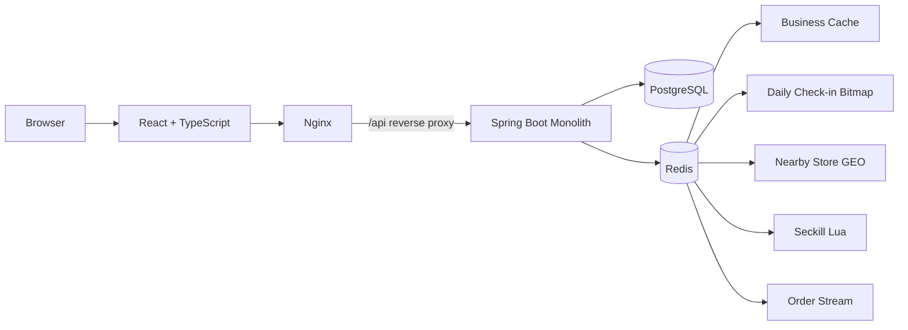
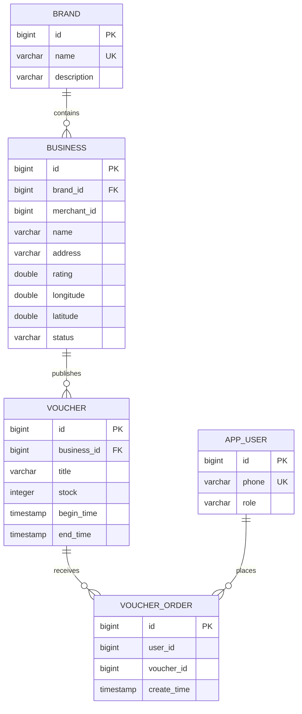
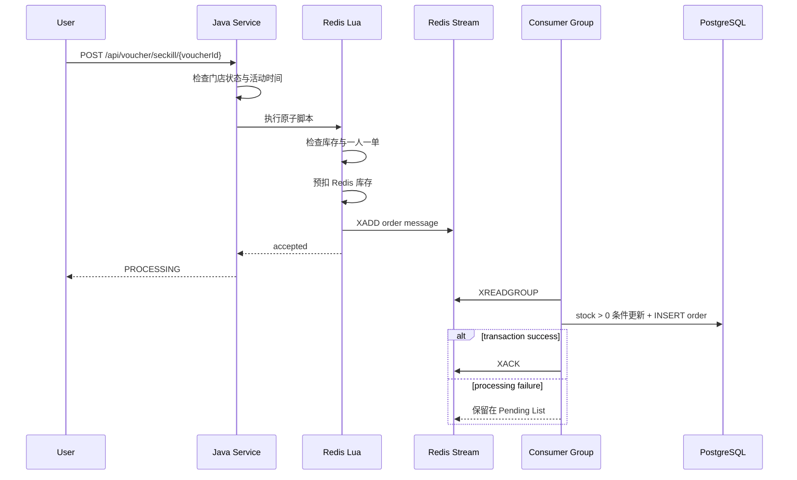

# LocalLife

LocalLife 是一个本地生活点评与营销平台，支持用户发现附近门店、查看和领取限时优惠券，也支持商户管理品牌、门店与营销活动。项目最初参考黑马点评的典型业务场景，并在此基础上扩展了完整前端、PostgreSQL 持久化、Docker Compose 交付、角色隔离、Redis GEO 门店发现与 Redis Stream 异步订单链路。

这是一个可在本地完整运行和验证的学习型工程项目，不代表已经被真实商家采用的 SaaS，也不对吞吐量或生产环境 SLA 作未经测试的承诺。

## 项目亮点

### Redis 秒杀链路

- Java 在调用 Lua 前检查门店状态和活动时间，只有 `ACTIVE` 门店且满足 `beginTime <= now < endTime` 才能继续。
- Lua 原子完成 Redis 库存检查、一人一单资格检查、库存预扣和 Stream 入队。
- 接口返回 `PROCESSING`，数据库写入由 Consumer Group 异步完成。
- PostgreSQL 事务使用 `stock > 0` 条件更新扣减库存，并创建 `VoucherOrder`。
- `(user_id, voucher_id)` 唯一约束是最终幂等边界。
- 仅在数据库事务成功后 ACK；处理失败不 ACK，消息保留在 Pending List，消费者累计失败次数并在配置阈值时记录告警。

### Redis GEO 附近门店

- 创建或更新 `ACTIVE` 门店时，将经纬度写入 Redis GEO。
- Redis 返回指定半径内的门店距离，并按距离升序排列。
- 门店关闭或物理删除时从 GEO 移除。
- PostgreSQL 状态会被再次检查，历史脏 GEO 数据也不会让 `CLOSED` 门店出现在用户结果中。
- 用户可主动授权浏览器定位，也可使用明确标注的测试位置完成本地演示。

### 用户与商户隔离

- 账号首次登录时，根据 `loginMode` 创建为 `USER` 或 `MERCHANT`。
- 已存在账号的数据库角色必须与登录入口一致，不能通过切换入口升级角色。
- 商户写接口同时受服务端 `RoleGuard` 保护，前端隐藏菜单不是权限边界。

### 门店及历史数据生命周期

- `Business` 支持 `ACTIVE -> CLOSED`，关闭门店只修改状态，不删除 Voucher 或 VoucherOrder。
- `CLOSED` 门店不再出现在发现页和附近门店，也不能创建活动或继续秒杀。
- 有关联 Voucher 的门店不能物理删除；有领取记录的 Voucher 不能物理删除。
- 过期活动和历史订单继续保留，商户仍可查看历史营销活动。


## Architecture



系统保持单体架构。Nginx 提供前端静态资源并将 `/api` 转发给 Spring Boot；后端统一访问 PostgreSQL 与 Redis，没有引入微服务、消息中间件集群或 API Gateway。

## 核心业务

### USER

- 通过本地验证码登录并查看当前用户信息。
- 浏览、搜索 `ACTIVE` 门店。
- 使用当前位置或测试位置查看附近门店和距离。
- 查看门店详情及当前营销活动。
- 发起优惠券秒杀，接收真实的 `PROCESSING`、重复领取或库存不足结果。
- 在“我的优惠券”查看已成功落库、未过期且所属门店仍营业的券。
- 通过现有 API 完成每日签到和连续签到统计。

### MERCHANT

- 通过商户入口登录。
- 创建 Brand。
- 创建或编辑 Business，并设置地址、纬度和经度。
- 创建 Voucher，设置库存、开始时间和结束时间。
- 查看活动状态、剩余库存和订单数量。
- 关闭门店并保留营销活动和订单历史。
- 物理删除没有关联历史数据的门店或营销活动。

## 数据模型



- **Brand**：连锁或独立品牌。
- **Business**：具体门店，保存坐标、评分和营业状态。
- **Voucher**：门店发布的限时营销活动。
- **VoucherOrder**：用户领取记录，也是“我的优惠券”的数据来源。

## 秒杀设计

简单的 `HTTP -> SELECT stock -> UPDATE -> INSERT` 会把热点库存竞争直接压到数据库，并容易产生超卖或重复下单窗口。本项目把资格判断和库存预扣前置到 Redis，同时仍以 PostgreSQL 事务与唯一约束作为最终一致性边界。



### 一致性边界

1. Java 拒绝未开始、已结束或所属门店已关闭的活动，非法请求不会进入 Lua。
2. Lua 保证 Redis 内的重复资格检查、库存预扣和入队是一个原子操作。
3. Consumer 在单个 PostgreSQL 事务内完成数据库库存条件扣减和订单写入。
4. 数据库唯一约束处理最终重复写入竞争。
5. ACK 位于事务方法成功返回之后；异常消息留在 Pending List，消费循环优先处理 Pending 再读取新消息。

该设计用于展示一致性边界和故障处理思路，并不等同于未经压测的生产级消息保证。

## Redis 使用场景

| Redis capability | 当前用途 |
| --- | --- |
| Cache | Business 详情缓存与缓存重建互斥 |
| Bitmap | 每日签到及连续签到天数计算 |
| Set | 点评点赞用户集合 |
| GEO | 附近门店检索、距离计算和排序 |
| Lua | 秒杀库存与重复领取原子校验 |
| Stream | 异步订单消息、Consumer Group、ACK 与 Pending 重试 |

## 生命周期规则

### Business

```text
ACTIVE ──商户关闭──> CLOSED
```

- 关闭是状态变更，不是 DELETE。
- `CLOSED` 门店不对普通用户展示、不参与 GEO 查询、不能创建 Voucher，也不能秒杀。
- 没有任何 Voucher 的门店仍可物理删除。
- 只要存在 Voucher，就拒绝物理删除，以保留关联历史。

### Voucher

用户端状态根据 `beginTime`、`endTime` 和库存动态计算：

- 未开始
- 进行中
- 已结束
- 已抢完

这些是响应和 UI 状态，不是数据库 Enum。过期 Voucher 不会自动删除；用户端默认隐藏失效券，商户端仍可查看历史活动。有 VoucherOrder 的 Voucher 禁止物理删除。

### VoucherOrder

VoucherOrder 是领取历史，不会因为活动过期或门店关闭而删除。“我的优惠券”只是按有效期和门店状态过滤展示，底层历史记录仍保留。

## 技术栈

| Layer | Technology |
| --- | --- |
| Backend | Java 17, Spring Boot 3.5.14, Spring MVC |
| Frontend | React 18.3.1, TypeScript 7.0.2, Vite 8.2.2 |
| Database | PostgreSQL 16, Spring Data JPA, Hibernate |
| Cache / Async | Redis 7.4, Lua, Redis Stream |
| Deployment | Docker, Docker Compose |
| Reverse Proxy | Nginx 1.27 |
| Testing | JUnit 5, Mockito, Spring MVC Test |

## Quick Start

仅需安装 Docker 与 Docker Compose v2：

```bash
git clone https://github.com/yshskyyy/locallife.git
cd locallife
cp .env.example .env
docker compose up --build -d
docker compose ps
```

`.env.example` 提供本地占位配置。复制后请替换其中的示例凭据；`.env` 已被 `.gitignore` 忽略，不应提交到仓库。

等待四个服务均显示 `healthy`：

| Service | Address |
| --- | --- |
| Frontend | http://localhost:3000 |
| Backend | http://localhost:8080 |
| PostgreSQL | localhost:5432 |
| Redis | localhost:6379 |

停止服务并保留数据：

```bash
docker compose down
```

仅在确认可以清空当前项目本地数据时使用：

```bash
docker compose down -v
```

后端容器通过 `postgres` 和 `redis` 服务名连接依赖，并等待两者 healthy 后启动；frontend 等待 backend healthy。PostgreSQL 空数据卷首次启动时自动执行 `src/main/resources/schema.sql`，Spring Boot 使用 `ddl-auto=validate` 检查实体与 schema 是否一致。

## API 与 Demo

### 主要 API

| Method | Path | Purpose |
| --- | --- | --- |
| POST | `/api/user/code` | 获取本地验证码 |
| POST | `/api/user/login` | USER / MERCHANT 登录 |
| GET | `/api/user/me` | 当前用户上下文 |
| POST | `/api/user/sign` | 每日签到 |
| GET | `/api/user/sign/count` | 连续签到天数 |
| GET | `/api/businesses` | ACTIVE 门店列表与关键词搜索 |
| GET | `/api/businesses/nearby` | Redis GEO 附近门店 |
| POST | `/api/businesses` | MERCHANT 创建门店 |
| PUT | `/api/businesses/{id}` | MERCHANT 编辑门店 |
| POST | `/api/businesses/{id}/close` | MERCHANT 关闭自有门店 |
| DELETE | `/api/businesses/{id}` | 安全物理删除空门店 |
| GET / POST | `/api/brands` | 查询或创建品牌 |
| GET / POST | `/api/stores/{businessId}/vouchers` | 查询或创建营销活动 |
| DELETE | `/api/vouchers/{voucherId}` | 删除无领取记录的活动 |
| POST | `/api/voucher/seckill/{voucherId}` | 发起异步秒杀 |
| GET | `/api/me/vouchers` | 当前用户可用优惠券 |

除公开登录入口外，业务请求通过 `Authorization: Bearer <credential>` 携带登录凭证。示例不在 README 中保存真实手机号或凭证值。

### 演示流程

本地开发验证码固定为 `123456`，仅用于演示环境。

1. 在“商户登录”使用一个新的测试手机号登录。
2. 创建 Brand，再创建 Business；填写地址、纬度和经度。
3. 创建库存和时间范围明确的 Voucher。
4. 退出后，在“用户登录”使用另一个测试手机号登录。
5. 在“发现”浏览门店，点击“查看附近门店”主动授权定位，或使用明确标注的测试位置。
6. 打开门店详情并发起秒杀，页面显示 `PROCESSING`。
7. 消费完成后刷新“我的优惠券”，确认领取结果已经落库。
8. 商户关闭门店后，用户刷新发现页和附近门店，确认该门店消失；历史 VoucherOrder 仍保留。

测试位置只用于本地 Redis GEO 演示，不代表用户的真实位置。定位被拒绝或不可用时，页面会给出提示并允许继续使用测试位置，不会阻塞其他功能。

## 可靠性设计

| Boundary | Implementation |
| --- | --- |
| 非法活动拦截 | Java 在 Lua 前检查 Business 状态和活动时间 |
| Redis 原子性 | Lua 同时检查重复领取和库存，并完成预扣与 XADD |
| 数据库库存 | `UPDATE ... SET stock = stock - 1 WHERE stock > 0` |
| 最终幂等 | PostgreSQL 唯一约束 `(user_id, voucher_id)` |
| ACK 时机 | 数据库事务成功返回后才 ACK |
| 消费失败 | 不 ACK，保留在 Pending List；累计失败次数并在配置阈值时告警 |
| 历史数据 | CLOSED、过期和领取记录通过过滤展示，不级联删除 |

当前 Consumer 使用单实例固定名称，适合本地演示；多实例部署前仍需完善消费者身份、可观测性、告警和人工重放工具。

## Testing & Verification

验证命令：

```bash
mvn test
mvn clean package
npm --prefix frontend run build
docker compose build backend frontend
docker compose up -d
docker compose ps
git diff --check
```

最近一次自动化测试结果：

```text
Tests run: 43
Failures: 0
Errors: 0
Skipped: 0
```

自动化测试主要覆盖：

- USER / MERCHANT 登录角色一致性与商户接口授权；
- 门店列表关键词查询回归；
- ACTIVE / CLOSED 可见性、关闭与删除规则；
- Redis GEO 距离顺序和 CLOSED 脏数据过滤；
- nullable rating 创建、序列化与排序；
- Voucher 创建、时间边界与删除约束；
- 秒杀前置时间和门店状态校验；
- 数据库库存条件扣减和订单事务幂等。

Docker E2E 还验证过四服务健康、Redis 预扣库存、Stream 入队、数据库订单落库、库存扣减及消费完成后 Pending 数量归零。自动化测试目前没有直接模拟完整的 Consumer Pending 重放循环，因此该部分不作为单元测试覆盖项。

## 项目结构

```text
.
├── src/main/java/                 # Spring Boot 业务代码
├── src/main/resources/
│   ├── application.properties
│   ├── schema.sql                 # PostgreSQL 初始化结构
│   └── seckill.lua                # Redis 原子秒杀脚本
├── src/test/java/                 # JUnit / Mockito 测试
├── frontend/                      # React + TypeScript + Vite
├── Dockerfile                     # Backend 多阶段构建
├── docker-compose.yml             # 四服务编排
├── .env.example                   # 本地配置模板
└── README.md
```

## Engineering Decisions

### Why Redis Stream instead of Kafka?

当前系统是单体学习和演示项目，Redis 已承担缓存、Bitmap、GEO 与 Lua 原子操作。Redis Stream 足以表达异步订单、Consumer Group、ACK 和 Pending 处理边界，没有为了增加技术名词而额外引入 Kafka。

### Why not microservices?

当前规模下，单体 Spring Boot 更容易完成开发、事务、测试和 Docker 交付闭环。项目重点是本地生活业务建模、Redis 使用方式和一致性边界，而不是强行拆分服务。

### Why no map SDK?

当前 GEO 功能关注附近门店检索。浏览器 Geolocation 提供用户坐标，Redis GEO 负责距离查询；商户在门店表单中直接维护地址和坐标。若未来有实际产品需求，可再评估地图或 geocoding 服务。

## 与原版黑马点评的区别

本项目保留了黑马点评中缓存、签到、附近门店和优惠券秒杀等典型学习场景，并在当前仓库中进一步实现：

- React、TypeScript、Vite 和 Nginx 组成的可操作前端；
- 从 MySQL 教学语境调整为 PostgreSQL，并使用明确 schema 与 `ddl-auto=validate`；
- PostgreSQL、Redis、backend、frontend 四服务 Docker Compose 交付；
- `USER` / `MERCHANT` 首次登录角色模型和服务端写接口校验；
- `Brand -> Business -> Voucher -> VoucherOrder` 的商户与用户演示闭环；
- Redis Stream Consumer Group、事务后 ACK、Pending 保留和失败计数告警；
- `ACTIVE` / `CLOSED` 门店生命周期及历史 Voucher/VoucherOrder 保留；
- 面向用户的 Redis GEO 操作入口、距离展示与测试位置 fallback；
- nullable rating 与“暂无评分”，避免虚假默认评分；
- 围绕权限、生命周期、时间边界、幂等、GEO 和查询回归的自动化测试。

这些扩展是在教程业务原型上的工程化演进，不表示该项目完全原创，也不等同于生产系统。

## Acknowledgements

原始业务场景和部分 Redis 实践思路来自黑马点评教程。感谢该教程提供本地生活业务与 Redis 学习入口；本仓库在其基础上完成了上述工程化改造与功能扩展。

## 已知限制

- 固定验证码仅适合本地开发演示，未接入短信服务。
- 角色模型只有 `USER` 和 `MERCHANT`，没有复杂 RBAC、商户审核或组织权限。
- VoucherOrder 尚未实现核销、支付、退款或转赠状态。
- Stream Consumer 使用固定单实例名称，缺少生产环境监控、死信转移和人工运维工具。
- 数据库初始化以 `schema.sql` 为主，尚未引入版本化迁移工具。
- 没有公开 benchmark，不声明具体 QPS 或生产部署规模。
